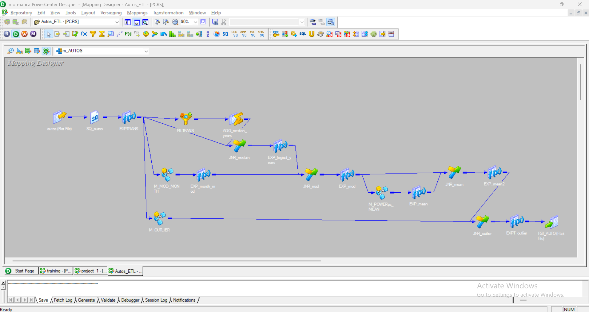

# 🚗 ETL Project using Informatica PowerCenter
---

## 🖼️ Screenshots

| Component         | Screenshot |
|------------------|------------|
| Mapping Overview |  |
| Outlier Mapplet  |  |
| Mode Mapplet     |  |
| Workflow         |  |

---

## 📌 Project Description

This is an end-to-end ETL project developed using **Informatica PowerCenter**. The goal of the project is to clean and transform raw car registration data and prepare it for analysis and reporting. The project simulates a real-world client scenario by handling data quality issues, transforming fields, handling missing and illogical values, and detecting outliers.

---

## 📊 Dataset Overview

The dataset used in this project contains information about car listings scraped from an online marketplace. Below is a summary of the columns available in the dataset:

| Column Name           | Description |
|------------------------|-------------|
| `index`               | Unique identifier for each row (usually auto-generated). |
| `dateCrawled`         | Date when the data was scraped from the website. |
| `name`                | Title or name of the car listing. |
| `seller`              | Type of seller (e.g., private or dealer). |
| `offerType`           | Type of offer (e.g., offer, request). |
| `price`               | Listed price of the car in Euros. |
| `abtest`              | A/B test flag used for internal site testing. |
| `vehicleType`         | Type of the vehicle (e.g., sedan, SUV, coupe). |
| `yearOfRegistration`  | Year the car was first registered. |
| `gearbox`             | Type of transmission (e.g., manual, automatic). |
| `powerPS`             | Power of the car in Pferdestärke (horsepower). |
| `model`               | Car model name. |
| `kilometer`           | Distance driven by the car in kilometers. |
| `monthOfRegistration` | Month the car was first registered. |
| `fuelType`            | Type of fuel used (e.g., petrol, diesel). |
| `brand`               | Car brand (e.g., BMW, Audi, Ford). |
| `notRepairedDamage`   | Indicates if the car has unrepaired damage. |
| `dateCreated`         | Date when the ad was created on the platform. |
| `postalCode`          | Postal code of the location where the car is listed. |


---


## 🔁 ETL Flow

1. **Extract** raw data from source (flat file or database).
2. **Transform** data using various transformations including:
   - Data type conversion
   - Handling null and illogical values
   - Date conversion and age calculation
   - Outlier detection
3. **Load** the cleaned data into the target table.

---

## 🔧 Data Transformations

### 🧮 Conversion & Cleanup

1. ✅ `yearOfRegistration` converted to decimal using:
   ```sql
   TO_DECIMAL(yearOfRegistration)
   ```

2. ✅ Date formatting for `dateCreated`:
   ```sql
   IIF(ISNULL(dateCreated), NULL, TO_DATE(dateCreated, 'YYYY/MM/DD HH24:MI:SS'))
   ```

3. ✅ Calculate age of the car:
   ```sql
   IIF(ISNULL(yearOfRegistration), NULL, GET_DATE_PART(SYSDATE, 'YYY') - yearOfRegistration)
   ```

4. ✅ Extracted **Day**, **Month**, and **Year** from relevant date columns.

---

### ⚠️ Data Quality Rules

5. ✅ **yearOfRegistration**: Remove illogical values. Assumed valid range is between **1910** and **2022**.

6. ✅ **monthOfRegistration**:
   - Handled value `0` (non-logical).
   - Replaced with **mode** value of the column using a **Mapplet**.

7. ✅ **powerPS**:
   - Treated values (0, 1, 2) as illogical.
   - Replaced them with **mean** value of `powerPS`.

---

### 📉 Outlier Detection

8. ✅ Used **Z-Score method** to detect outliers:
   - Calculated upper and lower limits.
   - Applied filter to remove outliers.
   - Logic encapsulated inside a **Mapplet**.

---

## 🔄 Transformations Used

- **Expression**
- **Filter**
- **Aggregator**
- **Joiner**
- **Mapplet**
  - For outlier calculation
  - For mode calculation

---

## 📚 Additional Notes

- Project developed as part of an ETL simulation to mirror real-world data engineering scenarios.
- All transformations and logic follow best practices in data cleaning and preparation.
